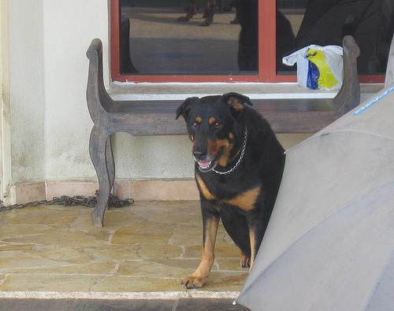

# Resfull People

1. Run following program using maven command:
```
mvn spring-boot:run
```
2. Open browser and see `localhost:8080`
3. Here is couple of snippets you can use for curl app:

To use POST method and add new user, use:
```
 curl -i -X POST -H "Content-Type:application/json" -d '{"firstName": "Frodo", "lastName": "Baggins"}' http://localhost:8080/people
```
To use DELETE method and delete given record use:
```
curl -i -X DELETE http://localhost:8080/people/1
```

To use GET method and receive records, use:
```
curl -i -X GET http://localhost:8080/people
```

To use PUT method and update whole object, use:
```
curl -i -X PUT -H "Content-Type:application/json" -d '{"firstName": "Adam", "lastName": "Mickiewicz"}' http://localhost:8080/people/2
```

To use PATCH method and update record partially, use:
```
curl -i -X PATCH -H "Content-Type:application/json" -d '{"firstName": "Juliusz"}' http://localhost:8080/people/2
```

# Exercise

1. Even you don't know Spring yet, it will be pretty usual in future to make something based on conventions.
2. Try to prepare `Dog` entity and repository. Spring will do the rest for you :-)
3. Dog should contain following fields:
- String name (`Pimpuś` is nice one)
- int age (`6`)
- int rating (`0` - `100`) but you can omit validation, assume fronted will validate it

- String breed (`Doberman`)
- String imageUrl
You can use following API to get some free urls https://dog.ceo/dog-api/breeds-list
4. Compile app once again and play with new endpoint.
5. Add some dogs
6. Try to find them
7. Delete some
8. Update age and breed of some. Like this one that was supposed to be `Rottweiler` :-)
